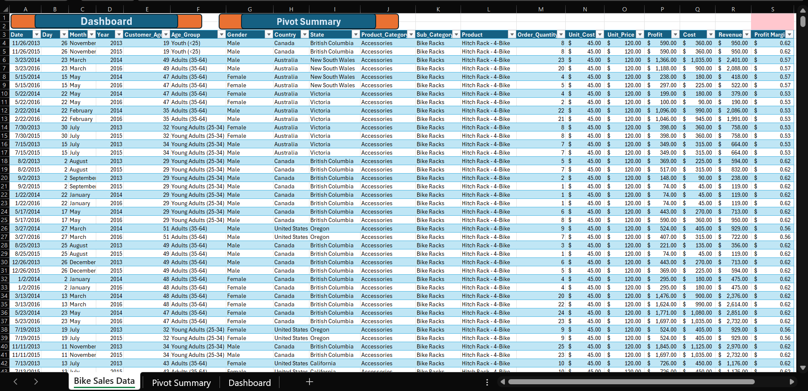
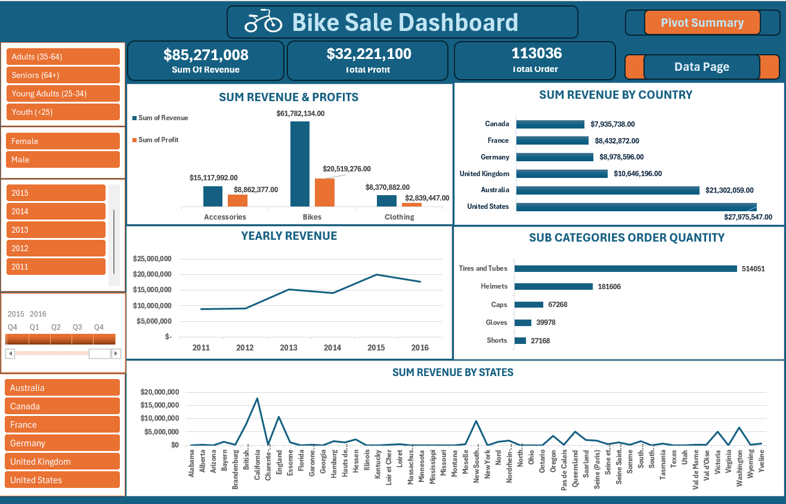

# Bike-Sales Analysis

### 📊 Project Overview

An end-to-end Excel Data Analytics project analyzing 113,036 bike sales records from 2011–2016. The project transforms cleaned transactional data into PivotTable analysis and an interactive dashboard to uncover trends in revenue, profit, products, customers, and geographic performance.

### 🎯 Business Objective

The analysis aimed to identify:

- Top-performing products and categories
- Revenue and profit trends
- Most valuable customer gender segments
- Best-performing countries and states
- Opportunities for growth and improved decision-making

### 🛠️ Tools & Skills

- Power Query: 
      - Data Cleaning, Calculated Columns
- Microsoft Excel: 
      - PivotTables, Pivot Charts, Slicers, KPI Analysis
      - Data Visualization, Exploratory Analysis, Business Intelligence.

### 📁 Dataset

The dataset contains 113,036 records and 19 columns, including:

      Date | Customer Age | Age Group | Gender | Country | State | Product Category | Sub-Category | Product | Order Quantity | Unit Cost | Unit Price | Profit | Cost | Revenue|
      Additional fields such as Day, Month, Year, and Profit Margin were used for analysis.

### 🔄 Project Workflow

- 1. Data Cleaning & Preparation
Cleaned and structured the transactional dataset and prepared calculated fields required for analysis.

- 2. PivotTable Analysis
Created PivotTables to analyze revenue, profit, quantity, products, customer demographics, locations, and yearly performance.

- 3. Interactive Dashboard
Built an Excel dashboard containing KPIs, charts, and slicers that allow users to dynamically explore performance by year, country, gender, product category, age group, and other dimensions.

### 📈 Key Performance Indicators

| Metric       |	Result       |
|------------- |---------------|
| Total Revenue|	$85.27M      |
| Total Profit |	$32.22M      |
| Total Cost   |	$53.05M      |
| Total Order  |  113036       |
| Units Sold   |	1.35M        |
| Profit Margin|	37.79%       |

### 🔍 Key Insights

+ 🚲 Bikes generated $61.78M, approximately 72% of total revenue, making them the strongest category.
+ 🛣️ Road Bikes led bike sub-categories with approximately $33.36M revenue.
+ 👥 Adults aged 35–64 were the highest-value customer segment, generating approximately $42.58M.
+ 📈 Revenue increased substantially over the period, reaching its highest annual result in 2015 at $20.02M.
  🇺🇸 The United States was the top country, generating approximately $27.98M.
+ 📍 California was the strongest U.S. state, generating approximately $17.67M.
+ ⚖️ Revenue was relatively balanced by gender: Male $43.34M vs Female $41.94M.
+ 🏆 Products such as Road-150 and Mountain-200 were among the strongest individual performers.

### Dashboard Visualization

### Project Download

[⬇️ Click here to Download the Bike Sales Project](https://github.com/soneyeopeyemi101/Bike-Sales-Analysis/raw/main/Bike-Sales-Analysis.xlsx)

### 💡 Business Recommendations

+ Prioritize high-performing Road and Mountain Bike products.
+ Target the 35–64 customer segment with focused marketing and retention strategies.
+ Strengthen operations in high-performing markets, particularly the U.S. and California.
+ Use accessories as cross-selling opportunities for bike customers.
+ Monitor yearly and seasonal trends to identify future growth opportunities.

### 🎯 Project Outcome

This project demonstrates the complete data analytics process of cleaning data → analyzing data → creating visualizations → generating business insights.

It showcases how I can use Excel to transform a large sales dataset into an interactive reporting tool that supports data-driven business decisions.

### 👤 Author

#### Opeyemi
+ Data Analyst | Excel | SQL | Power BI

